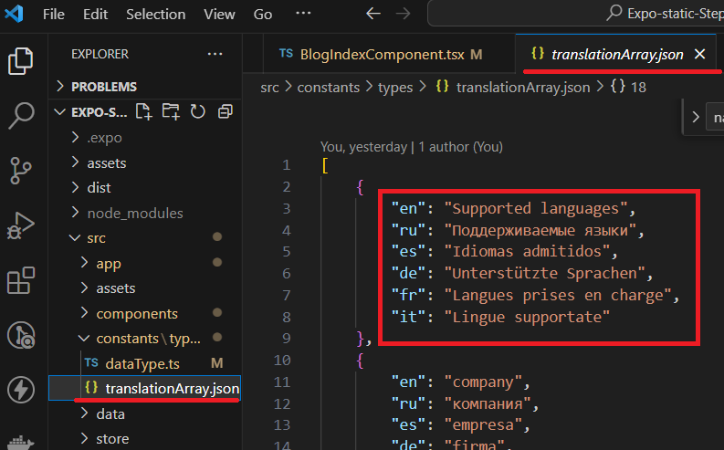
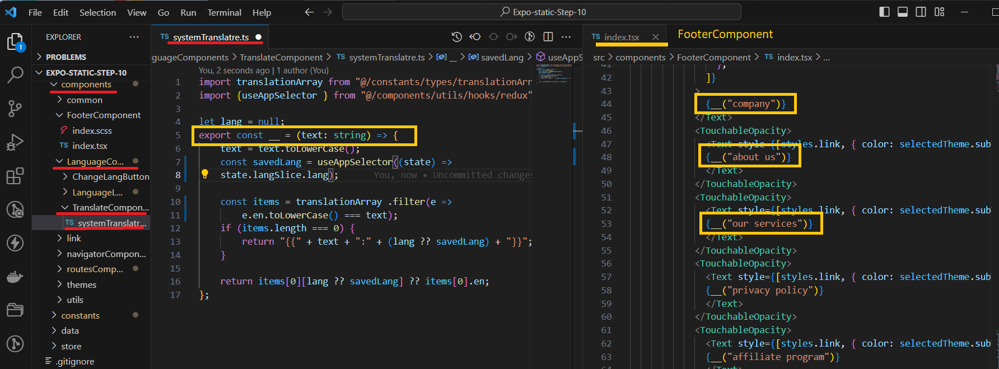

<!-- Banner Image -->

  <a href="https://expo.dev/">
    
    <h1 align="center">Expo Router v2 </h1>
    <h2 align="center">step by step tutorial </h2>
    <h3 align="center">At this stage, we are dealing with system translations and JSON for the static Expo-router v2 website</h3>
  </a>
<h5 align="center"> <a aria-label="expo documentation" href="https://maps.menu">We are revamping this: maps.menu 📚</a></h5>

  <a aria-label="" href="https://github.com/bolshiyanov/expo-router-v2-step9"><b>Go back to 9 step</b></a>
 | <a aria-label="" href="https://expo-router-v2-step10.vercel.app/"><b>Look web site for 10 step</b></a>
 |
  <a aria-label="" href="https://github.com/bolshiyanov/expo-router-v2-step11">Next 11 step 📚</a>

I won't be using a library like i18n for translations; I'll write my own script for this.

It's not complicated, and I don't need any extra libraries in the project, especially since in the future, translations for the control panel will be generated by ChatGPT, and I want to have full control over the process.

---

- [📚 About this step](#-documentation)
- [🗺 Stack of this step](#-Stack-of-this-step)
- [🏅 Why expo-router v2](#-Why-expo-router)
- [❓ Task](#-task)
- [💙 The Team](#-the-team)
- [License](#license)

<h2 align="center">...</h2>

## 📚 About this step

This step of my Expo-router v2 tutorial consists of two parts. In the first part, we will create system translations for buttons, inputs, links, and other parts of the project that are independent of the data coming from JSON.

The second part involves stories about how to translate data that comes to us from the server in JSON format. I will create the foundation for adding various data types to existing translations and will display the translation that corresponds to the system's language.

## 🗺  Step-by-Step Guide: 

1) First, I want to create a library that will have a JSON file containing all the system translations. At the current stage, I've limited it to six languages, but the system is flexible enough to add any number of languages as needed.

2) Here, I'm creating a highly compact function, "systemTranslate.ts," for translations with a simple structure. We will use this script in every component where we have texts. For example, we have a lot of translations in the "Footer" component.

3) Translate beautifully into English: "Now I will create a function for those components that take data and contain translated texts in fields such as 'descriptions,' 'name,' and others.

The 'transformData' function takes the field name as its first parameter and the current page language obtained from 'props' as well as the object itself.

In its body, the function compares the received language with the list of supported languages from 'config.' The function will return the corresponding translation, and if the language is not supported, it will display the default language translation.

With this, the translation work is complete.

Once we start receiving translations from the server, I will add the ability to store translations in the Reducer to extract the dependency for the project's root.

I will do it like this: until translations are received from the server, display the project without translations. After the translations are loaded, they will be added to the version of the application without translations.

In my experience, translations can take up quite a bit of space and should not hinder the application.

However, this will be implemented step by step when we start working with a real server in step 13.

Next steps, 11:
I will create a search and filtering page.

In step 12, I will add the layout of the main page and work on the application's appearance.

I'm glad you've read this far.

## ❓ Task

In the 'name' field of any project, English names often repeat in other languages. This creates a lot of redundant data.

Add the following logic to the project:

1) In translateData.ts, replace all duplicates of the English version of each item.name with "*";

2) In transformLanguageData, the logic is as follows:

If a "*" is found in the translation field, replace "*" with the text from the nameEn field."

## 🗺 Stack of this step
`new`
- [`expo-localization`](expo-localization) A library that provides an interface for native user localization information.

`earlier versions`
- [`flatlist`](flatlist) A FlatList in React Native is a component for efficiently rendering lists of data in a mobile app.
- [`reduxjs/toolkit`](reduxjs/toolkit) A Comprehensive Library for Efficient State Management and Development.
- [`local storage`](local-storage) Browser local storage is a feature that allows websites to store data locally on a user's device.
- [`scss`](scss) Supported scss for web.
- [`react-native-svg-transformer`](react-native-svg-transformer) Supported SVG images.
- [`expo-router-v2`](expo-router-v2) Supported static web generation, css , seo.
- [`expo-router`]( expo-router) There is no specific package called "expo-router." Expo uses React Navigation for routing
- [`expo`](expo) Expo is a platform simplifying React Native development through tools, libraries, and workflow enhancements.
- [`react-dom`](react-dom)React package enabling rendering of components in the web browser's DOM (Document Object Model).
- [`react native`](react-native) JavaScript framework for building cross-platform mobile applications.
- [`react`](react) JavaScript library for building user interfaces, maintained by Facebook and a community.
- [`typescript`](typescript) TypeScript is a superset of JavaScript adding static typing for enhanced code quality and tooling.
- [`gitHub`](gitHub) GitHub is a web-based platform for version control and collaboration using Git.
- [`netlify`](netlify) Netlify is a web hosting platform for deploying and managing modern web projects.

## 🏅 Why expo-router v2

 landscape of modern business, the effectiveness of customer acquisition and retention takes on profound importance. The intersection where the cost of drawing in initial customers converges with the metrics of retention and Lifetime Value establishes a pivotal nexus for real-world enterprises. It's within this context that businesses frequently navigate towards the realm of search engine optimization, leveraging its potential to tap into organic traffic from behemoths like Google. 

Undoubtedly, a website serves as an inviting initial point of contact between the business and potential clientele. However, its true value shines when users willingly return, reinforcing the need for a captivating and compelling platform. This brings us to the second interaction with customers, where the objective shifts to providing a seamless, native application experience tailored for iPhones and Android devices. Hence, discerning businesses harmonize their approach by upholding a static website for search engine visibility and a dynamic mobile application for app marketplaces. 

Until recently, achieving such intricate synergy was primarily the domain of expansive teams like Twitter. This involved intricate orchestration of web and native components by scores of developers. Yet, the landscape has metamorphosed with the emergence of Expo Router Version 2. This paradigm shift has overhauled the development process, empowering developers to craft code within a unified ecosystem and effortlessly export the final product as both a static website and a feature-rich app available on the Play Store. 

Moreover, the realm of possibilities has expanded to encompass wearable gadgets, such as the Apple Watch, thanks to Expo Router's extended support. In mere minutes, updates can be seamlessly integrated, thereby revolutionizing the agility with which businesses can refine their offerings. This ushers in an unmatched opportunity to harness the complete potential of the internet, propelling businesses towards the attainment of their goals. 

The democratization of this robust framework marks a monumental stride forward. The once imposing barriers that impeded smaller entities from realizing their digital ambitions have now dissolved. Expo Router introduces an era of accessibility, bestowing entrepreneurs and businesses alike with the means to bridge the gap between their vision and its actualization. As businesses embark on this journey, they gain the capability to enthrall audiences, nurture loyalty, and elevate their digital footprint – all while streamlining the development process in ways that were once the exclusive domain of a select few. 

In a world where triumph pivots on the symbiotic interplay between innovation and execution, Expo Router stands as a testament to technology's power to democratize opportunities. It embodies the shift that has unfolded in the landscape of app and web development – transitioning from the intricate and unwieldy to the intuitive and efficient. As businesses embrace this evolution, they set out on a transformative trajectory, shedding the constraints of the past and venturing into a future where every aspiration for digital resonance and engagement can be woven into reality. 

## 💙 Author

Roman Bolshiyanov < status : open for cooperation, look job >

## License

The Expo source code is made available under the [MIT license](LICENSE). Some of the dependencies are licensed differently, with the BSD license, for example.

